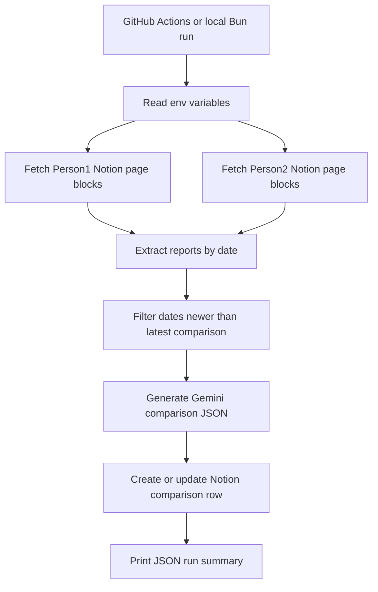

# Notion Report Comparison Bot

An automated TypeScript workflow that reads daily engineering reports from two Notion pages, compares them with Google Gemini, and stores the resulting executive summary in a Notion database. It is designed for lightweight daily reporting, manager review, and historical comparison of team or individual progress.

## Demo

This project does not include a hosted UI. The primary output is a Notion database row created or updated for each report date, plus a JSON summary printed to the console.

## Features

- Fetches report content from two Notion pages.
- Groups report entries by `Date:` markers.
- Compares matching report dates with Gemini.
- Handles missing reports for either source with clear fallback text.
- Produces structured comparison fields for individual work, common work, productivity, and overall assessment.
- Upserts one comparison row per date into a Notion database.
- Skips previously processed dates by checking the latest comparison date.
- Runs locally with Bun or automatically through GitHub Actions.

## Tech Stack

- TypeScript
- Bun
- Notion API via `@notionhq/client`
- Google Gemini via `@google/genai`
- `dotenv` for local environment configuration
- GitHub Actions for scheduled automation

## Architecture



## Project Structure

```text
.
|-- .github/
|   `-- workflows/
|       `-- daily.yml
|-- fetch.ts
|-- index.ts
|-- package.json
|-- prompt.ts
|-- README.md
|-- tsconfig.json
`-- types.ts
```

## Installation

1. Clone the repository:

   ```bash
   git clone <repository-url>
   cd notionReportComparision
   ```

2. Install dependencies:

   ```bash
   bun install
   ```

## Environment Variables

Create a `.env` file in the project root for local development.

```env
NOTION_TOKEN=
BMW_PAGE_ID=
PORCHE_PAGE_ID=
AI_COMPARISONS_DATABASE_ID=
GEMINI_API_KEY=
```

| Variable | Description |
| --- | --- |
| `NOTION_TOKEN` | Internal integration token used to read pages and write comparison rows in Notion. |
| `BMW_PAGE_ID` | Notion page ID containing Person1 daily reports. |
| `PORCHE_PAGE_ID` | Notion page ID containing Person2 daily reports. |
| `AI_COMPARISONS_DATABASE_ID` | Notion database ID where AI-generated comparison rows are created or updated. |
| `GEMINI_API_KEY` | Google Gemini API key used to generate the comparison summary. |
| `PARENT_PAGE_ID` | Present in the workflow secrets, but not used by the current script. |

## Usage

Run the automation locally:

```bash
bun index.ts
```

The script will:

1. Read reports from the configured Notion pages.
2. Extract dated report sections.
3. Compare unprocessed dates with Gemini.
4. Create or update rows in the configured Notion comparison database.
5. Print a JSON summary of created or updated pages.

## Automation

The project includes a scheduled GitHub Actions workflow at `.github/workflows/daily.yml`.

```yaml
on:
  schedule:
    - cron: "30 21 * * *"
  workflow_dispatch:
```

The workflow runs daily at `21:30 UTC` and can also be started manually from the GitHub Actions tab. It installs Bun, installs dependencies, and runs:

```bash
bun index.ts
```

Add the required environment variables as GitHub repository secrets before enabling the workflow.

## Example Output

When new dates are processed, the script prints a JSON array like this:

```json
[
  {
    "date": "2026-07-07",
    "action": "created",
    "pageId": "notion-page-id"
  }
]
```

When no newer reports are available, it prints:

```json
{
  "message": "No new report dates found after the last compared date.",
  "lastComparedDate": "2026-07-07"
}
```

## Configuration

### Report Format

Each source Notion page should contain report text with sections beginning with `Date:`.

```text
Date: 2026-07-07
Completed API integration work.
Resolved dashboard issues.
Blocked on final QA feedback.
```

### Comparison Database

The Notion comparison database should include these properties:

| Property | Type |
| --- | --- |
| `Date` | Title |
| `BMW` | Rich text |
| `Porche` | Rich text |
| `Common Work` | Rich text |
| `Productivity Analysis` | Rich text |
| `Overall Assessment` | Rich text |

### AI Prompt

The comparison prompt is defined in `prompt.ts`. It instructs Gemini to return strict JSON with concise bullet arrays for:

- `bmw`
- `porche`
- `commonWork`
- `productivityAnalysis`
- `overallAssessment`

## APIs & External Services

- Notion API: reads source report pages and writes comparison results.
- Google Gemini API: generates structured report comparisons.
- GitHub Actions: runs the scheduled daily automation.

## Roadmap / Future Improvements

- [ ] Add automated tests for report parsing and Gemini response validation.
- [ ] Add stricter environment variable validation at startup.
- [ ] Support configurable person/team labels instead of hard-coded report names.
- [ ] Add richer Notion blocks for formatted comparison output.
- [ ] Add notification support after a successful daily run.

## Contributing

Contributions are welcome. To contribute, fork the repository, create a focused feature branch, make your changes, and open a pull request with a clear description of the problem and solution.

## License

No license file is currently included.

## Acknowledgements

- [Bun](https://bun.sh/) for the TypeScript runtime and package management.
- [Notion SDK for JavaScript](https://github.com/makenotion/notion-sdk-js) for Notion API access.
- [Google Gen AI SDK](https://www.npmjs.com/package/@google/genai) for Gemini integration.
